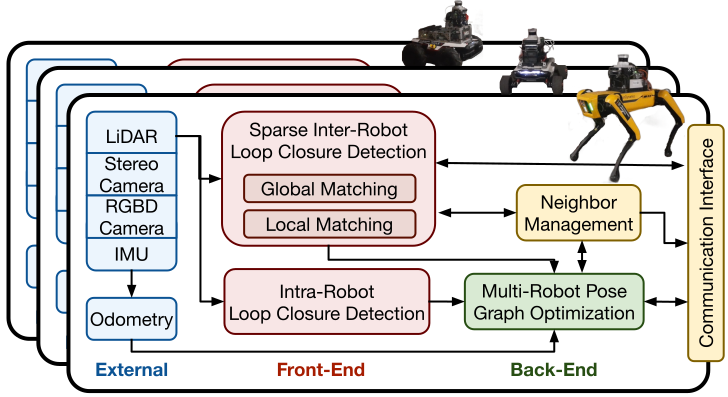

# Swarm-SLAM: Sparse Decentralized Collaborative Simultaneous Localization and Mapping Framework for Multi-Robot Systems



Swarm-SLAM is an open-source C-SLAM system that is designed to be scalable, flexible, decentralized, and sparse, which are all key properties in swarm robotics. Our system supports lidar, stereo, and RGB-D sensing, and it includes a novel inter-robot loop closure prioritization technique that reduces inter-robot communication and accelerates the convergence.

Look up our [Documentation](https://lajoiepy.github.io/cslam_documentation/html/index.html) and our [Start-up instructions](https://lajoiepy.github.io/cslam_documentation/html/md_startup-instructions.html)!

How to cite:
```

```
